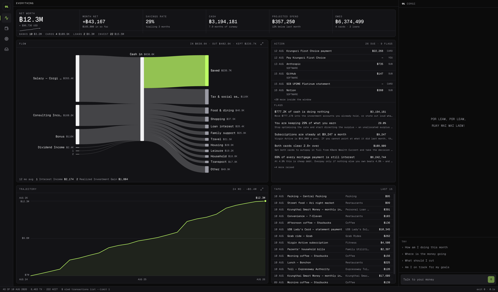

<h1 align="center">
  <strong>OpenLedger CFO</strong>
</h1>

<p align="center">
  OpenLedger CFO tells you what to do about your money, powered by
  <a href="https://www.npmjs.com/package/@aquartier/openledger">OpenLedger</a>,
</p>

<p align="center">
  A terminal with AI agent, and double-entry ledger that using your bank statement data, running privately on your machine.
</p>

<p align="center">
  
</p>

OpenLedger CFO helps you visualize your finances: ask the CFO where the money goes, your runway, your mortgage, and your savings rate.

## Built on OpenLedger

Every number on screen is derived, at request time, from [OpenLedger](https://www.npmjs.com/package/@aquartier/openledger): a deterministic, double-entry ledger CLI that keeps your financial data in a local database.

### OpenLedger enabled four things:

- **Double-entry honesty**: every transaction debits one account and credits another. Money never appears from nowhere.
- **Local and private**: statements, balances, and history stay in your machine, masks PII before reach outbound network.
- **Deterministic and auditable**: the CLI emits with a structured JSON data with strict and deterministic exit-code contract.
- **Agentic-ready by design**: OpenLedger was built to be driven by an AI. This repo is the working proof.

## Running Demo

You need three things. Check each one:

```bash
node --version     # ^22.21 or >=24 (Node 23 is not supported)
pnpm --version     # pnpm package management
oled --version     # npm install -g @aquartier/openledger
```

Then:

```bash
# clone this project
git clone https://github.com/phureewat29/openledger-cfo.git
cd openledger-cfo

# install the OpenLedger CLI
npm install -g @aquartier/openledger

# install dependencies
pnpm install

# load the demo dataset
pnpm bootstrap

# serve the production build
pnpm build && pnpm serve

```

You should see the demo dataset. If a pane says the ledger is not initialized, run `pnpm bootstrap` again and watch its checks print.

To wake the CFO chat, press **AI Gateway Configuration** in the chat pane and point it at any OpenAI-compatible gateway. Endpoint, API key, and model are saved in the app and take effect at once — no env file, no restart.

`pnpm bootstrap` destructively resets the repo-local ledger in `.oled/` to the demo dataset. It never touches `~/.oled`; the loader refuses to run against anything but this repo's config, and that guard is in code, not convention.

## The AI layer

Two agents, both built on [deepagents](https://www.npmjs.com/package/deepagents) over any OpenAI-compatible gateway. Configure it in the app — **AI Gateway Configuration** in the chat pane: base URL, API key, and a model id defaulting to `qwen/qwen3.8-27b`. The settings live in the local control plane, and the test button proves the connection before you save:

- **The CFO Agent**
- **The Ingest Agent**

## How it works

```
apps/web (Next.js 16)                    packages
+--------------------------------+       +--------------------------------+
| pages: server components,      | tRPC  | api: routers over the ledger   |
| derived per request            +------>+ and the SQLite control plane   |
|                                |       +---------------+----------------+
| chat + ingest runs:            |                       |
| route handlers, SSE, abort     |       +---------------v----------------+
+--------------------------------+       | openledger: typed connector,   |
                                         | two serialized exec lanes,     |
                                         | Result unions, masked secrets  |
                                         +---------------+----------------+
                                                         |
                                             spawns `oled` per call
```

## Development

```bash
pnpm dev         # start local development
pnpm typecheck   # builds the dist-publishing packages first, then checks everything
pnpm lint        # eslint across the workspace
pnpm format      # prettier check
pnpm build       # full production build
```

## Layout

```
apps/
  web/            the terminal app
    src/app/      routes; each route pairs page and skeleton through one grid.ts
    src/components, src/domain, src/server, src/trpc
packages/
  openledger/     typed connector over the oled CLI, plus the smoke harness
  api/            tRPC routers
  db/             drizzle schema for the plan tables and the AI gateway configuration
  agent/          cfo and ingest personas, tools, and the stream bridge
  demo/           the dataset generator, its invariants, and data/life.json
  ui/             ui and design system
tooling/          shared toolchain
```

## Troubleshooting

- **`oled` was not found**: `npm install -g @aquartier/openledger`, then `oled --version`.
- **Tables missing or empty**: `pnpm db:push` recreates the schema in `cfo.db`, and `pnpm bootstrap` reseeds it.
- **Node 23**: not in the support range. Use 22.21+ or 24+ (`.nvmrc` pins 22.21).
- **Ingest cannot read a document**: image-only PDFs need OCR — enable it under **AI Gateway Configuration** and point it at any OpenAI-compatible vision endpoint (defaults to Typhoon OCR, sharing the gateway credentials). The settings are forwarded to `.oled/config.json`, and the demo loader preserves them across resets; without OCR only text-layer PDFs work.
- **Typecheck errors that make no sense**: a stale `dist/`; run `pnpm typecheck` from the root so the packages rebuild first.
- **Worried about your real ledger**: this repo only ever runs `oled` with `--config` pointing at its own `.oled/`; your `~/.oled` is never read or written.

## License

AGPL-3.0. Copyright (c) 2026 Phureewat A. See [LICENSE](LICENSE).
